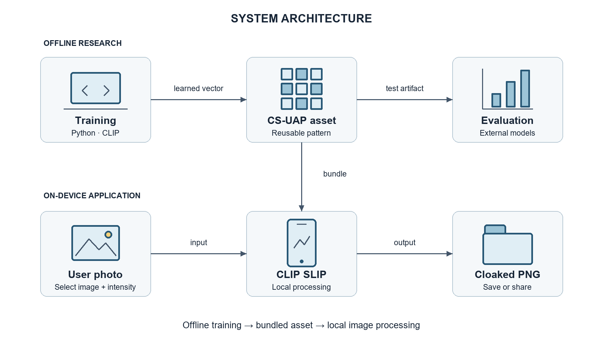
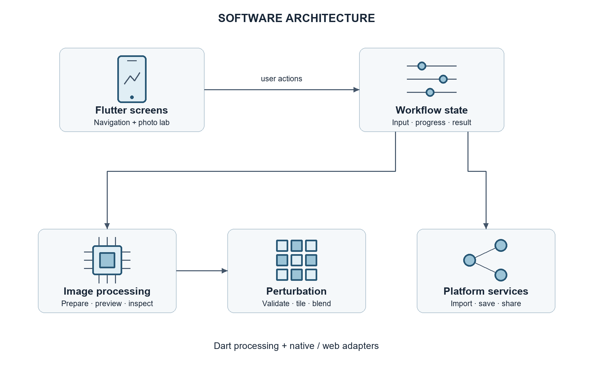
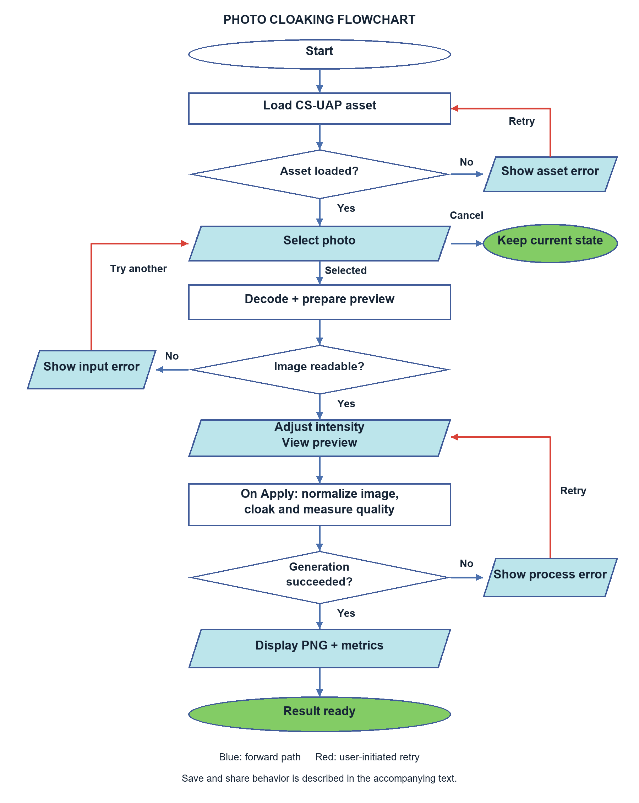
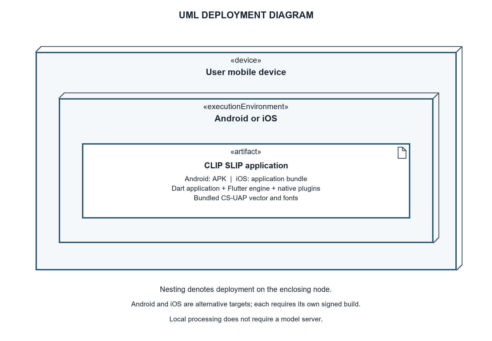
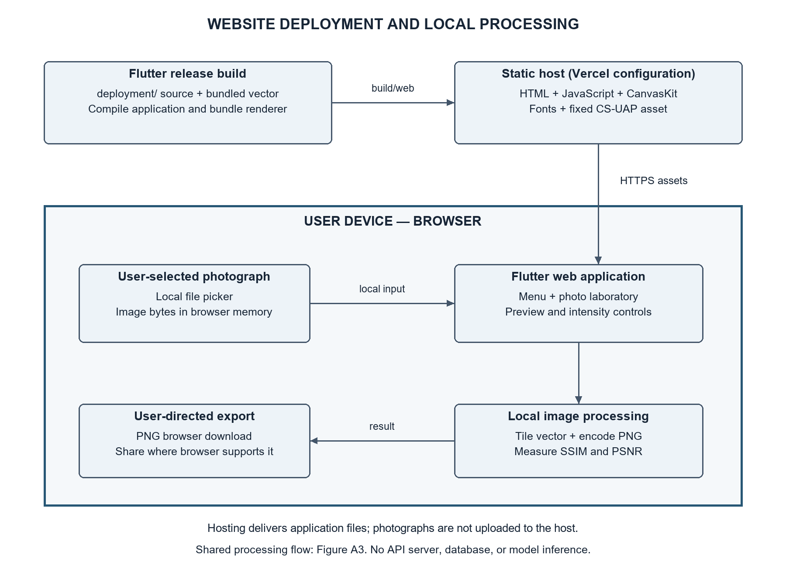

# CHAPTER 3
# RESEARCH DESIGN AND METHODOLOGY

## Application Framework and Deployment

This section describes the application component of the context-specific universal adversarial perturbation (CS-UAP) framework. It addresses the objective of providing a mobile-accessible interface through which users can apply the trained perturbation to their own photographs. The application, named CLIP SLIP, connects the offline research pipeline to a local image-processing workflow. Its design includes photograph selection, perturbation-intensity adjustment, preview generation, full-resolution processing, image-quality inspection, and export.

The application is implemented using Flutter and Dart. The training and research evaluation programs remain separate Python components. The discussion documents the current application design and specifies the activities required to prepare and validate its deployment. It does not treat the presence of a platform project as evidence that the application has been released or tested on that platform.

### Scope and Design Objectives

The application is designed around four objectives. First, it makes the trained CS-UAP available as a reusable local asset. Second, it allows the user to control the applied intensity and inspect the resulting photograph. Third, it measures image distortion using the generated output rather than relying on the preview. Fourth, it supports saving and sharing through the services available on the selected platform.

The deployed application does not retrain CLIP, generate a new optimized perturbation for each photograph, or execute the study's captioning and downstream generative experiments. CLIP Score, ClipCap/BERTScore F1, and SDXL LoRA evaluation belong to the research pipeline. The application's SSIM, PSNR, and MSE measurements describe image quality and are not proof of semantic protection.

## Components and Design

### System Architecture

The system is divided into an offline research environment, an application environment, and an external evaluation environment. The offline environment produces the perturbation vector and converts it into a binary asset that can be packaged with the application. The application environment receives a user-selected photograph and applies the asset locally. The evaluation environment uses research datasets and models to examine semantic disruption and downstream effects separately from ordinary application use.

**Figure A1. System architecture and boundary between offline research and application execution.**

The packaged asset is the connection between training and deployment. In the current design, updating the bundled vector requires replacing the asset and distributing an updated application build. No remote asset-update service is implemented. The photograph does not need to be uploaded to a research server for the cloaking calculation. A user-selected sharing destination may transmit the exported image outside the application.

### Software Architecture

The Flutter implementation follows a separation between presentation, screen-level workflow coordination, image-processing functions, and platform integrations. These are logical responsibilities within the codebase rather than a claim that the application implements a formal layered architecture framework. The photo laboratory coordinates operations using its StatefulWidget state and setState; no separate backend controller or database service is required.

**Figure A2. Logical software components of the Flutter application.**

**Table A1. Application components and responsibilities.**

| Component | Source module | Responsibility |
|---|---|---|
| Entry and navigation | main.dart and intro_screen.dart | Starts CsuapApp and opens the laboratory, field guide, research, and credits screens. |
| Laboratory coordinator | ProtectionScreen and _ProtectionScreenState in main.dart | Loads the vector, accepts images, manages intensity and progress, and coordinates preview, generation, and export. |
| Processing functions | lab_processing.dart | Normalizes photographs, prepares previews, generates cloaks, and measures exported-image quality. |
| Perturbation application | perturbation_protection.dart | Validates the vector, repeats it spatially, blends pixel values, and encodes PNG output. |
| Export integrations | main.dart and share_image_file files | Saves to the gallery, a selected destination, or a browser download; prepares images for platform sharing. |
| Research information | research_content.dart and research_screen.dart | Presents stored study information and recorded results, with optional external resource links. |

The image package supplies decoding, orientation normalization, pixel manipulation, and PNG encoding. Platform integrations use image_picker for image selection, gal for mobile gallery saving, file_selector for desktop save destinations, share_plus for sharing, and path_provider for native temporary-file placement. Conditional imports select the appropriate native or web sharing implementation.

### Data Design and Local Storage

An entity–relationship diagram is not appropriate for the current application because it does not implement a relational or NoSQL database. Instead, the design uses a bundled perturbation asset, in-memory processing objects, user-directed exports, and native temporary share files. Table A2 serves as the application data dictionary.

**Table A2. Application data dictionary and lifetime.**

| Data item | Representation | Purpose and lifetime |
|---|---|---|
| Perturbation asset | 224 × 224 × 3 little-endian float32 values in RGB HWC order | Bundled read-only input; loaded into memory for processing. |
| Source image | Uint8List | Selected image bytes held by the laboratory screen during its session. |
| Intensity | double in [0, 1], initially 0.5 | Scales the applied vector; changing intensity invalidates the previous result. |
| CloakPreview | Dimensions, sampled RGB bytes, sampled Float32List vector | Cached, bounded preview data associated with the selected image. |
| LabResult | Original baseline, output PNG, width, height, SSIM, PSNR; derived MSE | Holds the generated result and quality measurements in memory. |
| Exported image | PNG file or gallery item | Persisted after the user requests saving or completes sharing. |
| Native share file | PNG in the platform temporary directory | Supplies a file to the share interface; explicit immediate deletion is not implemented. |

The binary pattern contains 150,528 values and occupies 602,112 bytes, excluding other assets. Asset validation checks the expected value count and rejects non-finite values. The absence of a database means that account records, synchronized image collections, and a persistent protection history are outside the implemented application scope. Earlier conceptual diagrams that include these features should be revised or identify them as future work.

### Procedural Design

The main workflow begins when the laboratory loads and validates the bundled vector. The user selects a photograph or uses the mobile camera option. The application reads the selected bytes, prepares preview data, and displays the result at the selected intensity. Cancellation of the picker does not create a new result. Unreadable input is handled through an error message.

**Figure A3. Photo-cloaking procedure from initialization to a generated result.**

The flowchart uses ovals for start and completion states, rectangles for processing, parallelograms for inputs and displayed outputs, and diamonds for decisions. Blue arrows identify forward execution and red arrows identify user-initiated retry paths. A cancelled image selection preserves the current session. Saving and sharing are described in the following paragraph.

The export procedure branches between sharing and saving, then selects the mobile, browser, or desktop save path. Cancelling the desktop destination picker returns without writing a file. Export failures produce feedback and return control to the result screen; the user can then choose to retry. Opening the share interface does not establish that a recipient received the image.

The preview is bounded to at most 400 pixels along either dimension. Sampling uses original image coordinates for both the photograph and the repeated vector, preserving the spatial scale of the perturbation. Preview updates are coalesced into one active rendering job; when the intensity changes during rendering, the next iteration uses the latest value. The interface records the intensity actually rendered. Preview failure does not automatically prohibit full-resolution generation.

Full-resolution generation contains three stages. First, preparePhoto decodes the image, normalizes EXIF orientation, converts it to 8-bit RGB, and produces the original PNG baseline. Second, cloakPhoto applies the scaled vector using modulo indexing over the 224 × 224 pattern. Third, inspectPhoto compares the baseline with the generated PNG and returns a LabResult. Progress messages identify preparation, application, and quality measurement.

For pixel position (x, y), the pattern coordinate is (x mod 224, y mod 224). For input channel value p in [0, 255], perturbation value v, and intensity α, the exported channel is:

**p′ = round(255 × clip(p / 255 + αv, 0, 1)).**

This formulation retains the normalized photograph's dimensions while bounding every output channel. The current application implements pixel-space tiling. Frequency-domain injection or perturbation resizing described elsewhere in the research methodology should not be attributed to the mobile application without a corresponding implementation.

Quality inspection uses full-resolution RGB values. PSNR is calculated from mean squared pixel error, while SSIM uses uniform 7 × 7 windows and sample covariance. Identical images have infinite PSNR, and SSIM is unavailable when an image dimension is smaller than seven pixels. The research notebook's Gaussian SSIM protocol differs from this application protocol; the two must be documented separately or aligned before direct numerical comparison.

### Interaction and State Management

The laboratory state coordinates asynchronous processing and retains the current photograph, preview, and result. Processing functions remain separate from the interface, allowing pixel operations and image-quality calculations to be checked independently.

**Table A3. Principal user interactions and failure handling.**

| Interaction | Preconditions | Result or alternative path |
|---|---|---|
| Select photograph | Laboratory available | Prepares the selected image; cancellation preserves the existing session. |
| Adjust intensity | Preview data available and controls enabled | Requests updated preview and clears the previous generated result. |
| Apply cloak | Source image and vector available | Runs preparation, cloaking, and inspection; failure returns an actionable message. |
| Inspect result | Generation completed | Displays original/output comparison and measured image-quality values. |
| Save output | LabResult available and no export active | Invokes the platform save path; destination cancellation ends without saving. |
| Share output | LabResult available and no export active | Opens the platform share interface; completion does not prove delivery to a recipient. |

Each processing stage is awaited before the next begins. Native compute uses a background isolate; web compute executes on the main event loop. The laboratory manages busy, picking, and exporting flags to prevent conflicting actions, and reports processing failures before returning control to the user.

### Deployment Design

The deployment design separates development machines from the end-user device. Research scripts produce the vector, and the build environment packages that vector with the Dart implementation and platform integrations. The device executes the installed application without requiring the Python training environment. Android and iOS are the mobile targets represented in the project; desktop and web hosts provide additional deployment options subject to their own validation.

**Figure A4. UML deployment of the application artifact on a mobile device.**

The diagram uses UML node notation: a «device» represents the physical mobile device, an «executionEnvironment» represents its operating system, and an «artifact» represents the deployed application. Nesting shows the artifact deployed within the operating-system node hosted by the device. Android and iOS are alternative deployment configurations, not two operating systems on one device. The diagram expresses the intended deployment structure; it does not claim that distribution signing or device validation is complete.

**Table A4. Platform deployment configuration and validation requirements.**

| Platform | Current project configuration | Deployment validation |
|---|---|---|
| Android | SDK levels inherited from Flutter; Java/Kotlin target 17; example application identifier; release currently uses debug signing | Resolve and record SDK values, configure distribution identity and signing, and test media access and export on physical devices. |
| iOS | Deployment target 15.0; camera and photo-library usage descriptions declared | Configure signing and provisioning, then validate permission, capture, gallery, and sharing behavior. |
| Windows/Linux/macOS | Platform host projects included; macOS target 12.0 | Verify the packaged application, file dialogs, runtime requirements, and share support for each intended target. |
| Web | Browser host and download implementation | Verify image processing, download behavior, sharing availability, and responsiveness across intended browsers. |

The Android manifest declares media and storage permissions with version limits for older storage permissions. The iOS configuration provides purpose strings for camera and photo-library access. These declarations must be assessed together with actual plugin behavior on the target operating-system version. Permission denial and picker cancellation form part of device testing.

The deployment procedure consists of recording the build environment, verifying the bundled vector, resolving dependencies, running static analysis and automated tests, producing the intended release package, and installing it on representative devices. Mobile distribution additionally requires the appropriate application identity, signing, and platform provisioning. The current debug-signed Android release configuration is a development convenience and is not evidence of a distribution-ready package.

The core cloaking path operates locally. External research links and user-selected sharing destinations are separate interactions. The design does not imply that all exported or shared copies remain local, nor does it claim secure erasure of native temporary files. Changes to the perturbation asset should be accompanied by a recorded artifact identifier and repeat validation of loading, output generation, and quality measurement.

### Website Deployment and Browser Execution

The standalone website application is maintained in deployment/ under the name invisAI. It shares the mobile application's Flutter interface and local CS-UAP processing design. Figures A1–A3 therefore also describe the website's system boundary, software responsibilities, and processing flow; separate copies of those diagrams would repeat the same design. Figure A5 adds the essential website-specific view: static delivery, browser execution, and local export.

**Figure A5. Website deployment and the browser-local photograph processing boundary.**

The release build produces build/web containing the HTML entry point, compiled Dart application, CanvasKit renderer, fonts, and fixed perturbation asset. The repository includes a Vercel static-host configuration for deployment/; the diagram describes that configuration and does not establish that a public deployment has been verified. The browser downloads application resources over HTTPS, initializes Flutter, and opens the interface. Startup failures or prolonged loading display feedback and a retry control. The source web/index.html is a build template and must not be served as the compiled website.

Selected photographs remain in browser memory for preview, full-resolution cloaking, and image-quality inspection. The static host serves application files and does not receive photograph uploads. No application API server, database, or model-inference service is required. Export uses a browser download or the share interface where supported; any user-selected sharing destination is outside the local-processing boundary. Unlike native compute isolates, web compute executes on the browser's main event loop, so large photographs can temporarily pause interaction.

Website validation covers startup with locally hosted renderer assets, download failures, narrow portrait layouts, file-picker cancellation, preview and generation, PNG download, and browser-dependent sharing. The phone layout places a compact interactive PC illustration above the navigation controls, with scrolling retained for small screens and enlarged text. Browser, device, viewport, and release identifier should be recorded with the validation results. Offline startup is not guaranteed.

## Methodology for Application Development

### Incremental Development and Verification

An incremental development approach is appropriate for the application because interface behavior, image processing, and platform integration can be developed and verified in separate increments. The activities below define the application methodology and its required evidence. They do not establish a dated development history or stakeholder participation that has not been recorded.

**Table A5. Application development activities and expected artifacts.**

| Phase | Activities | Expected artifact or verification |
|---|---|---|
| Requirements analysis | Translate the mobile-accessibility objective into import, intensity, preview, generation, inspection, and export requirements. | Application scope and use-case definitions. |
| Architectural design | Separate research execution from local application processing; define module responsibilities and data lifetime. | System and software architecture diagrams, data dictionary, application flowchart, and UML deployment diagram. |
| Processing implementation | Validate the binary vector, normalize images, tile the pattern, encode output, and measure quality. | Reusable functions and tests using known pixel and metric cases. |
| Interface implementation | Connect navigation, progress states, preview, comparison, and error feedback. | Usable laboratory workflow and responsive-layout checks. |
| Platform integration | Connect image selection, optional camera capture, gallery saving, file destinations, and sharing. | Platform-specific behavior and permission test records. |
| Release verification | Record environment, analyze code, run tests, create the package, and perform device smoke tests. | Build artifact and traceable release-validation record. |
| Refinement | Address observed failures and separately collect stakeholder feedback. | Revised implementation and documented evaluation findings. |

### Application Testing and Evaluation Plan

Application evaluation distinguishes functional correctness, deployment performance, and stakeholder usability. Functional tests examine whether the output follows the declared pixel operation and whether the interface coordinates it correctly. Performance tests record processing time, memory use, and responsiveness on identified devices. Stakeholder evaluation examines whether users can understand and complete the workflow using the instrument selected for the study.

**Table A6. Application validation plan.**

| Area | Test procedure | Evidence to record |
|---|---|---|
| Asset and pixel correctness | Use known vectors, repeated-pattern boundaries, and selected intensity values. | Expected versus actual channel values and validation errors. |
| Preview consistency | Compare sampled preview pixels with corresponding full-resolution output pixels. | Pixel agreement and displayed-intensity consistency. |
| Metric correctness | Evaluate identical images, analytically known offsets, small images, and dimension mismatches. | Expected SSIM/PSNR/MSE behavior and edge-case handling. |
| Interface behavior | Exercise navigation, progress, comparisons, text scaling, and narrow layouts. | Automated assertions and any observed layout failures. |
| Device integration | Test camera/import, permission denial, save cancellation, gallery export, and sharing. | Device model, OS version, build identifier, and pass/fail observations. |
| Processing performance | Process defined image sizes repeatedly on each target device. | Run count, timings, peak memory where measurable, and responsiveness observations. |
| User evaluation | Administer the selected usability or acceptance instrument after representative tasks. | Instrument, participant criteria, responses, analysis method, and findings. |

Development and training work used Acer Aspire 7, Lenovo LOQ, and Acer Nitro V15 laptops. Their exact CPU, RAM, GPU, storage, and task assignments should be recorded for reproducibility. These machine names do not establish minimum requirements for the deployed application. Likewise, the existing automated test suite does not replace physical-device validation. Numerical test results and measured performance belong in Chapter 4, while this section defines how they should be obtained.

## Integration with the Research Methodology

The application contributes the deployable artifact and local processing procedure required by the study's mobile-accessibility objective. The research pipeline contributes the learned vector and the experiments used to evaluate semantic effects. Connecting these contributions requires tracking which perturbation artifact, intensity, preprocessing method, and metric configuration produced each evaluated image.

The present architecture supports application-level image generation and quality inspection. Claims about protection against CLIP-based interpretation, caption drift, or downstream adaptation require the separate model experiments specified in the research methodology. This boundary keeps the application documentation consistent with what the software actually executes.
