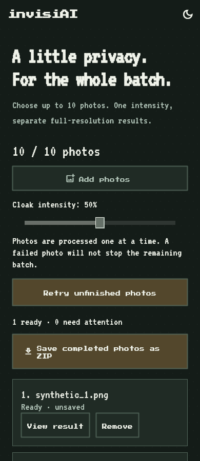
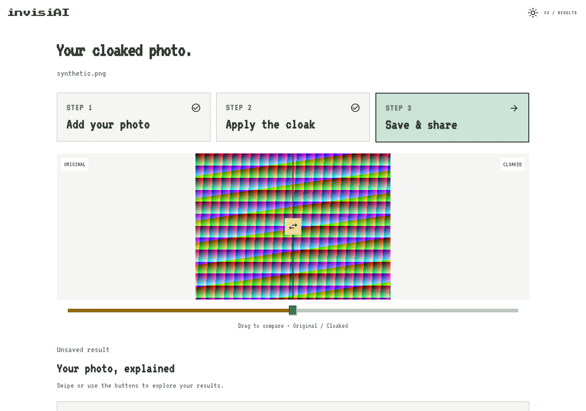

# invisiAI implementation and test evidence

Test date: 8 October 2026. These are developer-run engineering tests on the available Windows environment. No participant study or physical-phone evaluation was performed.

## Implemented behavior

- A single generated photo opens a separate results page, with comparison, quality insights and PNG export. Returning to the lab protects unsaved results and preserves the selected source photo.
- Batch photo lab accepts up to 10 images, processes them sequentially, retains successful results across cancellation/failures, retries unfinished photos, and supports individual review/export and ZIP export. Over-limit selections are rejected without dropping existing photos. Retained result PNGs have a 192 MiB safety limit; each input must be below 30 MiB and at most 24 megapixels.
- Progress uses weighted work checkpoints: decode, pixel blending, quality measurement and PNG encoding. The processor emits 100 only after receiving the completed result. Smooth display animation interpolates between those checkpoints. This is work progress, not a predicted duration; PNG encoding can pause between checkpoints. Batch 100% means all queued attempts finished, with successes and failures reported separately.

## Automated test results

| Check | Outcome |
| --- | --- |
| Static analysis | No issues found |
| Compiled web startup and renderer-failure retry | Passed in both variants |
| App Flutter suite | 56 passed |
| Deployment Flutter suite | 60 passed |
| 10-photo limit and atomic rejection | Passed |
| Sequential processing and per-photo failure/retry | Passed |
| Cancellation retaining completed photos and ignoring late results | Passed |
| ZIP duplicate names and byte preservation | Passed |
| Separate results navigation and unsaved save/discard guards | Passed |
| Light/dark result and batch layouts at 390 and 1280 logical pixels | Passed; screenshots below |
| Existing enlarged-text layouts at 320, 590 and 1100 pixels | Passed |
| Browser worker correctness, cancellation/restart, invalid input, disposal | Passed in app and deployment variants |
| Browser close/reload guard and unavailable-worker error handling | Passed in app and deployment variants |

The full test logs are in `app-tests.txt` and `deployment-tests.txt`. Some tests exercise simulated picker/export responses and controlled worker failures; they do not replace manual platform permission tests.

## Native processing timings

Three independent process launches per scenario, alpha 0.5, compiled Dart AOT executable using the app's current `generateWithProgress` pipeline. Each run uses a deterministic synthetic RGB image with R=(17x+y)%256, G=13y%256, B=(x+7y)%256, encoded as PNG. A batch repeats that image ten times and retains all ten outputs, matching sequential retention but excluding BatchSession/UI overhead. Input creation, asset loading, file selection, isolate startup, preview rendering and user export are outside the timed interval. No explicit warm-up was performed. Other development/build activity was present during this exploratory session; these are not controlled hardware comparisons.

| Resolution | Photos | Mean seconds | Range seconds | Largest process peak RSS (MiB) |
| --- | ---: | ---: | ---: | ---: |
| 640 x 480 | 1 | 0.443 | 0.422-0.479 | 27.3 |
| 1280 x 720 | 1 | 1.160 | 1.106-1.216 | 43.5 |
| 1920 x 1080 | 1 | 2.951 | 2.667-3.137 | 49.2 |
| 640 x 480 | 10 | 4.535 | 4.152-4.907 | 54.9 |

Memory values are the benchmark process's lifetime peak resident set size, including image creation and runtime allocations. They are not whole-app RAM usage or an isolated algorithm allocation measurement. Raw per-photo timings, output sizes, SSIM, PSNR and progress counts are in `benchmark_raw.json`; scenario timings are also in `timings.csv`.

## Browser evidence

The Edge integration harness used the same 640 x 480 synthetic fixture and real bundled perturbation asset. It compared output pixels, SSIM, PSNR, preview and histogram against the native reference. The app worker run took 5.526 seconds and the deployment worker run took 7.228 seconds, each with 87 strictly increasing percentage updates ending at 100. Their main-thread 10 ms heartbeat timers fired 522 and 663 times respectively during worker processing. This demonstrates an advancing event loop in these runs; it is not a frame-rate or input-latency measurement. These were single correctness runs under development load, not repeated browser performance benchmarks. Do not rank the two variants by these timings. See `browser-root.json` and `browser-deployment.json`.

## Screenshot evidence

Twelve widget-rendered PNGs in `screenshots/` show the actual Flutter widgets in light and dark mode at 390 x 900 and 1280 x 900 logical pixels: results, batch queue, and progress. They were captured from Flutter widget rendering with bundled fonts. The batch screenshot is a staged queue with one completed synthetic result; the progress screenshot is a staged 67% state. These are UI/layout evidence, not captures from a physical phone or a live ten-photo run.





Two additional `browser_startup_*.png` images are actual headless Edge captures at a 390 x 844 emulated viewport, verifying that both compiled sites render and dismiss loading. They are still desktop browser emulation, not physical-phone captures.

Windows release and both JavaScript web builds generated their artifacts successfully. Build logs are included. The web build emitted a Wasm suggestion; the app-root build additionally warned about a missing Cupertino font family. These warnings did not prevent the JavaScript build or startup smoke tests. PowerShell reported stderr from Flutter as a NativeCommandError in the redirected logs; the logs nevertheless end with the generated build artifacts. No Wasm build was evaluated.

## Environment and limitations

Flutter 3.47.2 stable; Dart 3.13.2. Full SDK metadata is in `flutter-version.json`. Hardware specifications were retrieved from Windows after permission was granted; raw values are in `device.json`.

| Component | Verified specification |
| --- | --- |
| Computer | Acer Aspire A715-42G |
| CPU | AMD Ryzen 5 5500U with Radeon Graphics |
| CPU cores / logical processors | 6 / 12 |
| Physical memory reported by Windows | 15.34 GiB (16,469,520,384 bytes) |
| OS | Microsoft Windows 11 Home Single Language |
| OS version / build | 10.0.26300 / 26300 |
| GPU | AMD Radeon(TM) Graphics (driver 31.0.21924.61) |
| GPU | NVIDIA GeForce RTX 3050 Laptop GPU (driver 32.0.16.1047) |

The native benchmark uses CPU processing; listing the GPUs does not imply GPU acceleration. Specifications were collected after the recorded runs; the timing data has not been changed.

These tests establish implementation behavior and processing measurements on synthetic inputs. SSIM and PSNR describe image similarity only. They do not establish resistance to recognition, LoRA training, identity recovery, or other models. No new model attack/effectiveness experiment, human usability survey, physical Android/iOS test or long-duration stability study was performed. Those results must not be inferred from this evidence.

## Reproduce

From the app root:

```powershell
flutter test --no-pub
flutter analyze --no-pub
dart compile exe tool/thesis_benchmark.dart -o build/thesis_benchmark.exe
python scripts/run_thesis_benchmark.py build/thesis-evidence
flutter test --no-pub test/thesis_evidence_test.dart
dart run tool/worker_fixture.dart
dart compile js -O2 --no-source-maps -o web/photo_worker.js lib/photo_worker.dart
dart compile js -O2 --no-source-maps -o build/worker-check/client.js tool/worker_client_check.dart
python scripts/check_photo_worker.py
```

The screenshot test writes to this dated evidence directory. Benchmark reruns default to a separate build directory so recorded data is preserved. Repeat browser commands from `deployment/` for that variant. For a formal thesis comparison, use the recorded hardware details and rerun with a fixed power mode and idle background workload, using multiple representative photographs and repeated trials.
